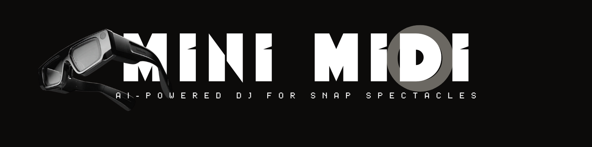
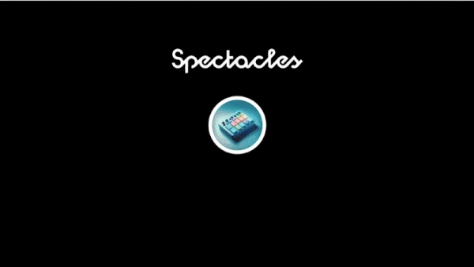

# 🎹 MiNiMIDI LYRIA

> **AI-Powered DJ for Snap Spectacles** — Generate unique beats with Google Lyria, mix in AR

[](https://lensstudio.snapchat.com/)
[](https://www.spectacles.com/)
[](https://www.typescriptlang.org/)
[](LICENSE)

<p align="center">
  
</p>

---

## 🎬 Demo

<p align="center">
  <a href="https://youtu.be/WdkZOLbd4og">
    
  </a>
  <br><br>
  <a href="https://youtu.be/WdkZOLbd4og">
    
  </a>
</p>

---

## ✨ What is MiNiMIDI LYRIA?

MiNiMIDI LYRIA transforms your Snap Spectacles into an **AI-powered music creation studio**. 

No pre-recorded samples. No loops from a library. Every beat is **generated on-the-fly** using Google's Lyria AI.

**Tap a pad → AI creates a unique 30-second loop → Mix in augmented reality**

---

## 🚀 Features

| Feature | Description |
|---------|-------------|
| 🎹 **9 MIDI Pads** | Toggle instruments on/off with visual feedback |
| 🎼 **5 Genres** | Electronic, Hip Hop, Lo-fi Jazz, House, Rock |
| 🤖 **AI Generation** | Unique loops via Google Lyria |
| 🎚️ **Real-time Volume** | Byte-level PCM processing at 48kHz |
| 🔄 **Dynamic Layers** | 10 audio channels with smart pooling |
| 👁️ **Visual Feedback** | Dot pool visualizer shows the mix |

---

## 🎼 Genres

| Genre | BPM | Vibe |
|-------|-----|------|
| 🎧 Electronic | 128 | Club, EDM, Synths |
| 🎤 Hip Hop | 90 | Trap, 808s, Beats |
| 🎷 Lo-fi Jazz | 75 | Chill, Relaxed, Smooth |
| 🏠 House | 124 | Disco, Funky, Groovy |
| 🎸 Rock | 120 | Guitar, Drums, Energy |

---

## 🛠️ Quick Start

### Prerequisites

- [Lens Studio 5.x](https://lensstudio.snapchat.com/download/)
- [Snap Spectacles (2024)](https://www.spectacles.com/)
- Google Cloud API access for Lyria

### Installation

```bash
git clone https://github.com/urbanpeppermint/MiNiMIDI_LYRIA.git
cd MiNiMIDI_LYRIA
# 🎹 MiNiMIDI LYRIA

> **AI-Powered DJ for Snap Spectacles** — Generate unique beats with Google Lyria, mix in AR

[](https://lensstudio.snapchat.com/)
[](https://www.spectacles.com/)
[](https://www.typescriptlang.org/)
[](LICENSE)

<p align="center">
  
</p>

---

## 🎬 Demo

<p align="center">
  <a href="https://youtu.be/WdkZOLbd4og">
    
  </a>
  <br><br>
  <a href="https://youtu.be/WdkZOLbd4og">
    
  </a>
</p>

---

## ✨ What is MiNiMIDI LYRIA?

MiNiMIDI LYRIA transforms your Snap Spectacles into an **AI-powered music creation studio**. 

No pre-recorded samples. No loops from a library. Every beat is **generated on-the-fly** using Google's Lyria AI.

**Tap a pad → AI creates a unique 30-second loop → Mix in augmented reality**

---

## 🚀 Features

| Feature | Description |
|---------|-------------|
| 🎹 **9 MIDI Pads** | Toggle instruments on/off with visual feedback |
| 🎼 **5 Genres** | Electronic, Hip Hop, Lo-fi Jazz, House, Rock |
| 🤖 **AI Generation** | Unique loops via Google Lyria |
| 🎚️ **Real-time Volume** | Byte-level PCM processing at 48kHz |
| 🔄 **Dynamic Layers** | 10 audio channels with smart pooling |
| 👁️ **Visual Feedback** | Dot pool visualizer shows the mix |

---

## 🎼 Genres

| Genre | BPM | Vibe |
|-------|-----|------|
| 🎧 Electronic | 128 | Club, EDM, Synths |
| 🎤 Hip Hop | 90 | Trap, 808s, Beats |
| 🎷 Lo-fi Jazz | 75 | Chill, Relaxed, Smooth |
| 🏠 House | 124 | Disco, Funky, Groovy |
| 🎸 Rock | 120 | Guitar, Drums, Energy |

---

## 🛠️ Quick Start

### Prerequisites

- [Lens Studio 5.x](https://lensstudio.snapchat.com/download/)
- [Snap Spectacles (2024)](https://www.spectacles.com/)
- Google Cloud API access for Lyria

### Installation

```bash
git clone https://github.com/urbanpeppermint/MiNiMIDI_LYRIA.git
cd MiNiMIDI_LYRIA
Open the .lsproj file in Lens Studio.

🎮 How to Use

Step	Action
1️⃣	SELECT GENRE → Tap a genre button
2️⃣	WAIT FOR AI → Lyria generates 9 unique loops
3️⃣	TAP TO PLAY → Toggle instruments on/off
4️⃣	MIX IT UP → Use volume slider, layer sounds
5️⃣	SWITCH GENRES → Loops are cached!
🔧 Technical Highlights

Byte-Level PCM Volume Processing
Real-time volume control without latency:

TypeScript

for (let i = 0; i < audioData.length; i += 2) {
    let sample = audioData[i] | (audioData[i + 1] << 8);
    if (sample > 32767) sample -= 65536;
    sample = Math.round(sample * volume);
    sample = Math.max(-32768, Math.min(32767, sample));
    if (sample < 0) sample += 65536;
    adjusted[i] = sample & 0xFF;
    adjusted[i + 1] = (sample >> 8) & 0xFF;
}
Dynamic Layer Pooling
10 audio layers shared across 45 pads (9 × 5 genres).

🙏 Built On

<p align="center"> <a href="https://github.com/urbanpeppermint/VIBE_MIDI_AI">  </a> </p>
Key components from VIBE_MIDI_AI:

🎚️ Multi-track audio layer management
📊 Dot pool visualizer for mixing math
🔊 Real-time volume fader with PCM processing
⚡ Debounced update system
📊 Performance

Metric	Value
Audio Channels	10 simultaneous
Sample Rate	48 kHz
Loop Duration	30 seconds
Volume Debounce	150ms
Genres	5
Pads per Genre	9
🔗 Links

Resource	Link
🎬 Demo Video	YouTube
🏗️ Foundation Project	VIBE_MIDI_AI
🕶️ Spectacles	spectacles.com
🎨 Lens Studio	lensstudio.snapchat.com
📄 License

MIT License - see LICENSE file.

<p align="center"> <strong>Built with 💜 for Snap Spectacles</strong> <br><br> <sub>by <a href="https://github.com/urbanpeppermint">@urbanpeppermint</a></sub> </p>
 
